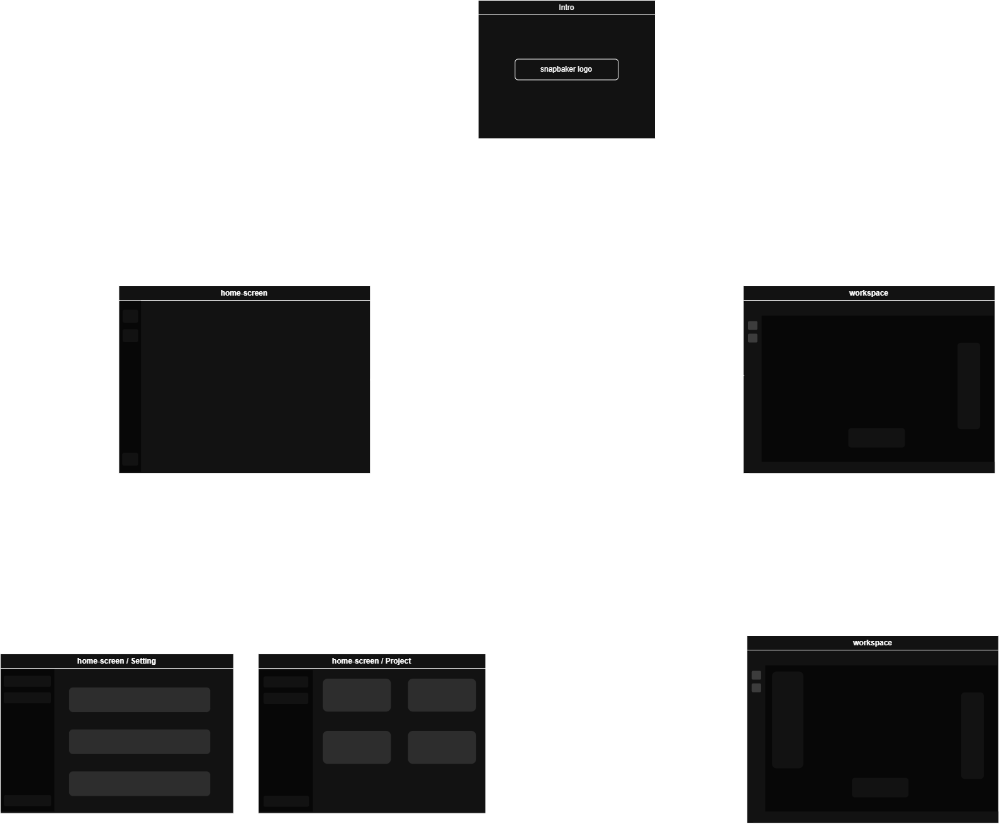
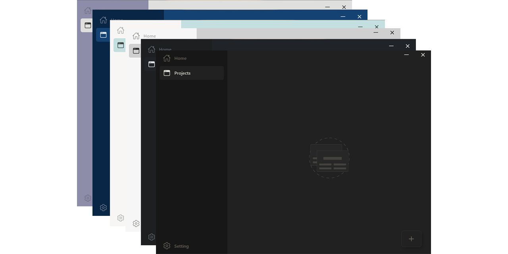

<p align="center"></p>
<p align="center"></p>
<h3 align="center">Bake your website with ease!</h3>
<hr>

<h3 align="center">Desktop application enables designers and developers to transform their designs and ideas into clean, responsive front-end code for web applications.</h3>

## Project conference

<p align="center">
  <a href="https://www.youtube.com/watch?v=ZfqLODTdApQ" target="_blank">
    
  </a>
</p>

> [!IMPORTANT]  
> This project is currently under construction. We welcome your contributions to its construction and development!

## Docs

- **[What Is SnapBaker ?](#what-is-snapbaker)**
- **[How Does It Work ?](#how-does-it-work)**
- **[Features](#languages)**

  - [Languages](#languages)
  - [Frameworks](#frameworks)
  - [Libraries](#libraries)

- **[App Wireframe](#app-wireframe)**
- **[App Colors](#app-colors)**

- **[Use](#prerequisites)**

  - [Prerequisites](#prerequisites)
  - [Installing SnapBaker](#installing-snapbaker)
  - [SnapBaker Setup](#snapbaker-setup)

- **[For Open Source Developers](#for-open-source-developers)**
- **[License](#project-license)**

## What Is SnapBaker ?

SnapBaker is a desktop application designed to streamline the process of building and managing websites. It features a dual-window interface:

**Home Screen** – Define your site's core properties and manage overall project settings.

**Workspace** – Build and edit your site's individual pages, and easily link between them.

Once your project is complete, you can access the Settings icon in the bottom-left corner of the workspace. From there, you can save, export, or customize details of your website as you made in the home screen.

## How Does It Work ?

SnapBaker works by generating and updating your website structure through a set of JSON-based instructions. When you add, remove, or style elements, SnapBaker records these actions as structured JSON "orders" and stores them in dedicated design files for each item on your site.

You can choose an AI model to interpret these orders and generate styled components or design suggestions based on your input. After reviewing and confirming the results, SnapBaker finalizes the build of your website.

## Languages

<p>
    <a href="#">
        
    </a>
</p>

## Frameworks

<p>
    <a href="#">
        
    </a>
    <a href="https://electron-vite.org/" style="margin-left:5px">
        
    </a>
</p>

## Libraries

<p>
    <a href="https://reactrouter.com/6.30.1" style="margin-right:5px">
        
    </a>
    <a href="https://react-icons.github.io/react-icons/" style="margin-right:5px">
        
    </a>
    <a href="https://redux-toolkit.js.org/" style="margin-right:5px">
        
    </a>
    <a href="https://www.npmjs.com/package/redux-state-sync">
        
    </a>
</p>

## App Wireframe

Wireframe not have all Designs:

<p align="center"></p>

## App Colors

**SnapBaker** have **`6`** color theme:

<p align="center"></p>

## Prerequisites

Before you begin, ensure you have met the following requirements:

<p>
    <a href="#">
        
    </a>   
    <a href="#" style="margin: 0 5px;">
        
    </a>
    <a href="#" style="margin: 0 5px;">
        
    </a>
</p>

## Installing SnapBaker

To install **SnapBaker**, follow these steps:

#### Windows:

```bash
git clone https://github.com/ahmed-abd-alalim/snapbaker.git

cd snapbaker
```

## SnapBaker Setup

#### Install:

```bash
$ npm install
```

#### Development:

```bash
$ npm run dev
```

<!-- #### Build:

```bash
# For windows
$ npm run build:win

# For macOS
$ npm run build:mac

# For Linux
$ npm run build:linux
``` -->

## For Open Source Developers !

SnapBaker is just getting started and you can help shape its future.

Whether you're a seasoned contributor or just getting started with open source, your skills and ideas are welcome here. From fixing bugs and improving UI to adding new features or refining the architecture every contribution matters.

By collaborating on SnapBaker, you'll be part of an exciting journey to create a powerful, AI-assisted website builder that empowers users and inspires creativity.

💡 Jump in, share your thoughts, open a pull request Together, we can build something amazing.

<p>
    <a href="./Contributing.md" target="_blank">
        
    </a>
</p>

<p>
    <a href="./ROADMAP.md" target="_blank">
        
    </a>
</p>

## Project License

Copyright (c) 2025 Ahmed Abd Alalim. All rights reserved.

This program has been licensed under the [MIT](LICENSE) License. If you are a true FOSS (Free And Open Source Software) Lover, you wont customize this and redistribute this under your name

---

_We hope you find snapbaker to be a valuable tool in your software development journey. If you have any questions, feedback, or suggestions, please don't hesitate to reach out. Happy bake with snappaker._
